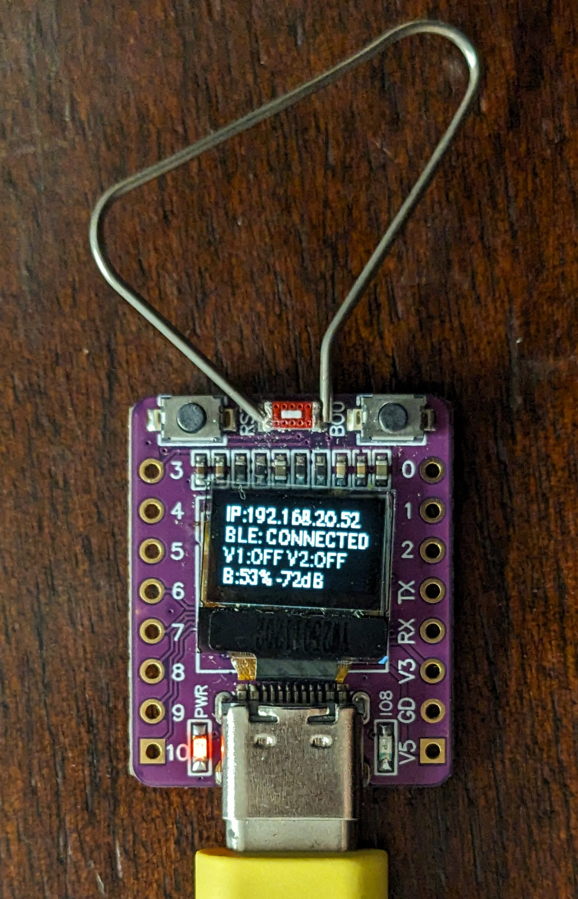

# ESP32-C3 Native Tuya BLE Gateway for Dual Water Timer

A 100% local, cloud-free, active Bluetooth Low Energy (BLE) gateway built with **ESPHome** on an **ESP32-C3 Super Mini** with an integrated **0.42" SSD1306 OLED display**.

This gateway replaces the cloud-dependent Tuya WG02 Wi-Fi gateway and talks directly to the Tuya BLE Dual Water Timer (`qycalacn` / `diivoo_wt05` / Insoma / Haozee) using on-chip AES-128-CBC encryption, MD5 session key negotiation, continuous link RSSI polling, and native two-way Home Assistant entities.

---

> [!IMPORTANT]
> ### ⚠️ Hardware Scope & Testing Disclaimer (Please Read First)
> * **Strictly Tested Hardware**: This entire repository, firmware, and custom C++ components have been **tried and tested ONLY on the physical Haozee Dual Bluetooth Water Timer** (2-valve model, Tuya Product ID `qycalacn`).
> * **Speculative Configurations**: Any provided templates, packages, or documentation for **1-valve, 3-valve, and 4-valve models are ENTIRELY SPECULATIVE**, derived from OEM specifications and community documentation. The maintainer does not own or test these variants.
> * **Applicability to Other Radios (RF / 433 MHz / Zigbee)**: The reverse-engineered Data Point (DP) structures, valve timing logic, and state management in this repo may serve as a valuable reference if you are building solutions for other communication technologies (such as 433 MHz / Sub-1GHz RF, HomGar gateways, or Zigbee). When adapting this architecture to other communication stacks or hardware platforms, **you are encouraged to fork this repository** and tailor the transport layer to your specific use case.

---

## Table of Contents
1. [Why This Was Built (The Architecture Problem)](#1-why-this-was-built-the-architecture-problem)
2. [Hardware Overview & Pinout](#2-hardware-overview--pinout)
3. [Step-by-Step: Extracting Keys from Tuya Cloud](#3-step-by-step-extracting-keys-from-tuya-cloud)
4. [Tuya BLE Protocol & Technical Fixes](#4-tuya-ble-protocol--technical-fixes)
5. [Data Point (DP) Mapping](#5-data-point-dp-mapping)
6. [ESPHome Custom Components & Modular Packages](#6-esphome-custom-components--modular-packages)
7. [Device Compatibility & Support Tiers](#7-device-compatibility--support-tiers)
8. [Complete ESPHome Configuration](#8-complete-esphome-configuration)
9. [Home Assistant Entity Reference](#9-home-assistant-entity-reference)
10. [Community Contributions & Requesting New Devices](#10-community-contributions--requesting-new-devices)
11. [Acknowledgments, Prior Art & License](#11-acknowledgments-prior-art--license)
---

## 1. Why This Was Built (The Architecture Problem)

### Why Generic `bluetooth_proxy` Failed:
Battery-powered Tuya BLE devices sleep aggressively and wake up for only short intervals to listen for incoming connections.
When using a generic ESPHome `bluetooth_proxy`:
* Every BLE GATT packet and cryptographic challenge had to travel across Wi-Fi to Home Assistant's Python BLE stack (`bleak`).
* Wi-Fi latency and packet jitter caused timing timeouts (`timeout receiving response, RSSI: -92`), and the timer went back to sleep before completing the handshake.

### The Solution:
By running the entire **Tuya BLE cryptographic stack directly on the ESP32-C3 in C++**:
* The ESP32 handles the sub-millisecond BLE timing and AES-128 handshake on-chip.
* The ESP32 maintains state and exposes native ESPHome `switch`, `sensor`, and `binary_sensor` entities to Home Assistant over the encrypted native ESPHome API.

```
+-------------------------------------------------------------+
|                        Home Assistant                       |
|           (Switches, Sensors, Automations, Dashboards)      |
+------------------------------+------------------------------+
                               | Native Encrypted API (Noise)
                               v
+-------------------------------------------------------------+
|               ESP32-C3 Super Mini BLE Gateway               |
|  - ESPHome Core & WiFi Management                           |
|  - Native C++ Tuya BLE Cryptographic Engine (AES-128 / MD5) |
|  - Active GAP RSSI Polling (3s interval)                    |
|  - 3-Minute Auto-Sleep SSD1306 72x40 OLED Display           |
|  - Physical BOOT Button (GPIO9) Toggle                      |
+------------------------------+------------------------------+
                               | 2.4 GHz Encrypted BLE
                               v
+-------------------------------------------------------------+
|             Tuya Dual Water Timer (Battery-Powered)         |
|  - Valve 1 Solenoid (Left)   | Valve 2 Solenoid (Right)     |
|  - Battery Level Monitoring  | Local Hardware Buttons       |
+-------------------------------------------------------------+
```

---

## 2. Hardware Overview & Pinout

### ESP32-C3 Super Mini with 0.42" OLED (New Gateway):

<p align="center">
  
</p>

> **Note on the Display:** The 0.42" OLED display is completely optional and is **not required** to build a fully functional, reliable gateway. The ESP32-C3 can run entirely headless, communicating all states, battery telemetry, link RSSI, and valve controls directly to Home Assistant over Wi-Fi.

* **SoC**: Espressif ESP32-C3 (RISC-V single-core @ 160MHz, BLE 5.0, Wi-Fi 4)
* **Display (Optional)**: 0.42" Monochrome OLED (72x40 pixels, SSD1306 driver)
* **Pinout**:
  * `I2C SDA`: **`GPIO5`**
  * `I2C SCL`: **`GPIO6`**
  * `I2C Address`: **`0x3C`**
  * `BOOT Button`: **`GPIO9`** (Active Low with internal pull-up)
  * `ESPHome Display Model`: `SSD1306 72x40`

---

### Stock Gateway Reference (WG02):
The original white/black plug-in Tuya WG02 gateway contains a **Tuya CR3L module** (Realtek Ameba RTL8720 Wi-Fi/BLE combo SoC). This gateway can be completely unplugged and removed once the ESP32-C3 gateway is deployed.

#### Original WG02 Housing:
| Front View | EU Plug View |
|:---:|:---:|
|  |  |

#### Original WG02 Internal PCB Teardown:
| PCB Front (Tuya CR3L Module) | PCB Rear |
|:---:|:---:|
|  |  |
---

## 3. Step-by-Step: Extracting Keys from Tuya Cloud

Whenever a Tuya BLE device is paired to the SmartLife app on your phone or to a gateway, Tuya generates a unique **Local Key** used for AES-128 encryption.

### Step 1: Link Device in SmartLife / Tuya App
1. Open the SmartLife app on your phone.
2. Put the timer into pairing mode (hold the button until the LED blinks rapidly).
3. Add the device to your account.

### Step 2: Query Tuya Cloud Developer API via Python
You can retrieve the fresh `local_key`, `device_id`, `mac`, and `uuid` with a short Python script using `tinytuya`:

```python
import tinytuya
import json

# Your Tuya Developer credentials (from https://iot.tuya.com)
c = tinytuya.Cloud(
    apiRegion="eu",                                      # 'us', 'eu', 'cn', or 'in'
    apiKey="yourtuyaaccessid",                       # Tuya Access ID / Client ID
    apiSecret="yourtuyaaccesssecret",       # Tuya Access Secret
    apiDeviceID="yourtuyadevice id"                       # Any valid device ID in account
)

# Fetch all registered devices with their fresh keys
devices = c.getdevices()
for d in devices:
    if "Timer" in d.get("name", "") or d.get("category") == "ggq":
        print("=== Water Timer Found ===")
        print(f"Device Name: {d.get('name')}")
        print(f"Device ID:   {d.get('id')}")
        print(f"Local Key:   {d.get('key')}")
        print(f"MAC Address: {d.get('mac')}")
        print(f"UUID:        {d.get('uuid')}")
        print(f"Product ID:  {d.get('product_id')}")
```

### Extracted Credentials for this Device:
* **MAC Address**: `DC:23:50:XX:XX:XX`
* **Device ID**: `b3243yh4w4`
* **Local Key**: `fromtuya...`
* **UUID**: `fromtuyaonlinedevplatform`
* **Product ID / Schema**: `qycalacn` (Category `ggq`, "Smart Dual Water Timer")

---

## 4. Tuya BLE Protocol & Technical Fixes

Several critical protocol bugs and timing nuances were resolved to make custom ESP32 firmware communicate reliably with Tuya BLE:

### 1. Key Derivation (`login_key` & `session_key`)
* Tuya BLE takes only the **first 6 bytes** of the 16-character `local_key` string:
  $$\text{local\_key\_6} = \text{local\_key}[0:6]$$
* **Login Key**: $\text{MD5}(\text{local\_key\_6})$
* **Session Key**: $\text{MD5}(\text{local\_key\_6} + \text{srand}[0:6])$ (where `srand` is a 6-byte random salt sent by the timer in response to `FUN_SENDER_DEVICE_INFO`).

### 2. The CRC-16 Polynomial Bug (Crucial Fix)
* **The Bug**: ESPHome's default `crc16()` helper in `helpers.h` implements CRC-16/CCITT (`0x1021`). Tuya BLE firmware requires **CRC-16/IBM (Modbus)** with polynomial `0xA001` and initial seed `0xFFFF`.
* **Symptom**: Decryption succeeded on the timer, but CRC check failed, causing the timer to drop the connection with HCI disconnect reason `0x13` (`Remote User Terminated Connection`).
* **Fix**: Implemented inline `tuya_crc16`:
```cpp
inline uint16_t tuya_crc16(const uint8_t *data, size_t length) {
  uint16_t crc = 0xFFFF;
  for (size_t i = 0; i < length; i++) {
    crc ^= data[i] & 0xFF;
    for (int j = 0; j < 8; j++) {
      if (crc & 1) crc = (crc >> 1) ^ 0xA001;
      else crc >>= 1;
    }
  }
  return crc;
}
```

### 3. Variable-Length Packet Framing Bug (Multi-Packet DP Fix)
* **The Bug**: Any DP command exceeds 17 bytes (4 bytes DP payload + 12 bytes meta + 2 bytes CRC = 18 bytes $\rightarrow$ padded to 32 bytes AES + 1 byte security flag + 16 bytes IV = 49 bytes).
* In Tuya BLE:
  * **Packet 0** has a 3-byte header: `[packet_num, total_len, protocol_version << 4]` (17 payload bytes).
  * **Packet 1+** has a 1-byte header: `[packet_num]` (19 payload bytes).
* The original library indexed using `i * 19`, skipping 2 bytes on subsequent packets and corrupting all valve commands.
* **Fix**: Implemented continuous chunk-stream packetizing on transmission and stream assembling on notification reception.

### 4. GATT Service Discovery
* Tuya devices expose characteristics `0x2B10` (Notification) and `0x2B11` (Write).
* The gateway checks all Tuya service UUIDs:
  * `00001910-0000-1000-8000-00805f9b34fb` (Standard)
  * `0000a201-0000-1000-8000-00805f9b34fb` (Tuya BLE v4)
  * `0000fd50-0000-1000-8000-00805f9b34fb` (Tuya Zigbee/BLE combo)

### 5. Active Connection RSSI Polling (`esp_ble_gap_read_rssi`)
* **The Problem**: Standard ESPHome `sensor.ble_rssi` only updates when passive advertising packets are detected. Once an active GATT connection is established, the water timer stops advertising, causing `sensor.ble_rssi` to report `nan` or freeze at the initial connection value.
* **The Solution**:
  * In `TuyaBLEClient::loop()`, `esp_ble_gap_read_rssi(this->remote_bda_)` is polled every **3 seconds** while connected.
  * Overriding `BLEClientBase::gap_event_handler` intercepts `ESP_GAP_BLE_READ_RSSI_COMPLETE_EVT` and updates `ble_node->rssi`.
  * An active template sensor queries `id(water_timer).get_rssi()` and continuously feeds live signal strength to Home Assistant and the OLED display.

### 6. OLED Display Power Management & Burn-In Prevention
* **Auto Sleep Timer**: An ESPHome script runs on boot and after interactions, turning the display off after **3 minutes** (`SSD1306_COMMAND_DISPLAY_OFF` / `0xAE`).
* **Physical `BOOT` Button (`GPIO9`)**: Pressing the `BOOT` button on the ESP32-C3 Super Mini toggles the display on/off and resets the 3-minute sleep timer.
* **Auto-Wake on Valve Actuation**: Whenever a valve is switched in Home Assistant, the OLED display automatically powers on for 3 minutes to confirm the updated state.

### 7. Independent Millisecond Run Duration Tracking
* **Why Hardware DPs Were Unreliable**: In Tuya's firmware, DP 110 is a single shared datapoint that is also re-broadcasted as a cached value on every general status update, leading to cross-valve misattribution when using passive DP routing.
* **The Precise Architecture**:
  * When **Valve 1** opens $\rightarrow$ records start time `esphome::millis()`. When it closes $\rightarrow$ calculates exact elapsed seconds and publishes directly to **`Last Run Time Valve 1`**.
  * When **Valve 2** opens $\rightarrow$ records start time `esphome::millis()`. When it closes $\rightarrow$ calculates exact elapsed seconds and publishes directly to **`Last Run Time Valve 2`**.
  * This guarantees **independent 1-second accuracy** for both valves regardless of whether they are actuated from Home Assistant, automated schedules, or physical buttons.
## 5. Data Point (DP) Mapping

From the cloud device schema query for `qycalacn`:

| DP ID | Hex | Type | Name in Cloud | Function in ESPHome |
|---|---|---|---|---|
| **105** | `0x69` | Boolean (`0x01`) | `switch_1` | **Valve 1 (Left Valve) Control** |
| **104** | `0x68` | Boolean (`0x01`) | `switch_2` | **Valve 2 (Right Valve) Control** |
| **11** | `0x0B` | Integer (`0x02`) | `battery_percentage` | **Battery Level (%)** |
| **106** | `0x6A` | Integer (`0x02`) | `countdown_1` | Irrigation duration 1 (minutes) |
| **103** | `0x67` | Integer (`0x02`) | `countdown_2` | Irrigation duration 2 (minutes) |
| **111** | `0x6F` | Integer (`0x02`) | `use_time_1` | Last Run Time Valve 1 (seconds) |
| **110** | `0x6E` | Integer (`0x02`) | `use_time_2` | Last Run Time Valve 2 (seconds) |
| **101** | `0x65` | String (`0x03`) | `normal_timer` | On-device schedule configuration |

---

## 6. ESPHome Custom Components & Modular Packages

### C++ Custom Components Architecture
The custom C++ components are located in the `components/` directory:

```
components/
├── tuya_ble_tracker/       # Handles BLE advertising detection & device parsing
│   ├── common.h            # Structures, CRC-16/Modbus, OpCodes
│   ├── common.cpp          # Hex formatting helpers
│   ├── tuya_ble_tracker.h
│   └── tuya_ble_tracker.cpp
├── tuya_ble_client/        # GATT client, AES-128 encryption, active GAP RSSI polling
│   ├── tuya_ble_client.h
│   └── tuya_ble_client.cpp
└── tuya_ble_node/          # Device instance, DP dispatcher, switch & sensor platforms
    ├── tuya_ble_node.h
    ├── tuya_ble_node.cpp
    ├── switch/             # ESPHome Switch entity (Valve 1 / Valve 2 / Valve 3 / Valve 4)
    │   ├── __init__.py
    │   └── tuya_ble_switch.h
    ├── sensor/             # ESPHome Sensor entity (Battery, Durations)
    │   ├── __init__.py
    │   └── tuya_ble_sensor.h
    └── binary_sensor/      # ESPHome Connectivity Sensor
        ├── __init__.py
        └── tuya_ble_binary_sensor.h
```

### Ready-Made Device Packages (`devices/`)
To simplify configuration and eliminate copy-pasting, pre-configured ESPHome packages are provided in the `devices/` folder:

* **`devices/water_timer_1valve.yaml`**: Single-valve timers (e.g., Diivoo WT-03 / WT-03W).
* **`devices/water_timer_2valve.yaml`**: Dual-valve timers (e.g., Haozee Dual, Diivoo WT-05 / WT-05W, SGW08MB).
* **`devices/water_timer_3valve.yaml`**: 3-valve timers (e.g., Diivoo 3-Zone Smart Timer).
* **`devices/water_timer_4valve.yaml`**: 4-valve timers (e.g., Diivoo WT-06, XinFuture 4-Zone, Nous L11).

You can import any package directly into your gateway YAML using ESPHome's native `packages:` feature:

```yaml
packages:
  timer: !include devices/water_timer_2valve.yaml
```

---

## 7. Device Compatibility & Support Tiers

See the full matrix in [WG02_Bluetooth_Compatibility.csv](WG02_Bluetooth_Compatibility.csv).

### Support Tiers
* **Tier 1: Confirmed & Actively Tested on Hardware**
  * **Haozee Dual Bluetooth Water Timer (`qycalacn`)**: Primary reference device. 100% verified locally for two-way valve actuation, runtime calculation, battery telemetry, and continuous RSSI.
* **Tier 2: Speculative OEM Irrigation Profiles (Community Feedback Needed)**
  * **Diivoo WT-05 / WT-05W / SGW08MB (2-Zone)**: Documented to share the exact same OEM hardware platform and DP specification as Haozee.
  * **Diivoo WT-03 / WT-03W (1-Zone)**: Speculative profile for the single-solenoid variant.
  * **Diivoo 3-Zone & 4-Zone (WT-06, XinFuture, Eshico, Nous L11)**: Speculative profiles for multi-valve manifold controllers using standard Tuya BLE boolean DPs.
* **Tier 3: Experimental / PR Submissions**
  * **Diivoo ITH-02 / Xiaoyi Soil & Climate Sensors**: Temperature/moisture data points.
* **Incompatible / Out of Scope**:
  * **Diivoo HomGar / RF Timers (e.g., WT-07W / WT-13W with HomGar Hub)**: Uses proprietary 433MHz/RF protocol, not Tuya BLE.
  * **Tuya BLE Smart Locks**: Requires dynamic ECDH pairing and cloud token verification.
  * **Xiaomi / Govee BLE devices**: Non-Tuya proprietary protocols.

---

## 8. Complete ESPHome Configuration

File: `local_BLE_water_timer.yaml`

```yaml
substitutions:
  device_name: ble-water-timer-gateway
  friendly_name: "BLE Water Timer Gateway"

esphome:
  name: ${device_name}
  friendly_name: ${friendly_name}
  on_boot:
    priority: -100
    then:
      - script.execute: display_timeout_script

script:
  - id: display_timeout_script
    mode: restart
    then:
      - delay: 3min
      - lambda: 'id(oled_display).turn_off();'

esp32:
  board: esp32-c3-devkitm-1
  framework:
    type: esp-idf

# Enable logging
logger:
  level: DEBUG

# Enable Home Assistant Native API
api:
  encryption:
    key: !secret api_encryption_key

ota:
  - platform: esphome
    password: !secret ota_password

wifi:
  ssid: !secret wifi_ssid
  password: !secret wifi_password

  ap:
    ssid: "BLE-Water-Timer Fallback"
    password: !secret ap_password

captive_portal:

external_components:
  - source: components

esp32_ble_tracker:
  scan_parameters:
    interval: 320ms
    window: 300ms
    active: true

tuya_ble_tracker:

tuya_ble_client:
  - id: tuya_client

tuya_ble_node:
  - id: water_timer
    mac_address: !secret water_timer_mac
    local_key: !secret water_timer_local_key
    device_id: !secret water_timer_device_id
    uuid: !secret water_timer_uuid
    tuya_ble_client_id: tuya_client

globals:
  - id: v1_start_ms
    type: uint32_t
    initial_value: '0'
  - id: v2_start_ms
    type: uint32_t
    initial_value: '0'

switch:
  - platform: tuya_ble_node
    tuya_ble_node_id: water_timer
    dp_id: 105
    name: "Valve 1 (Left)"
    id: valve_1
    icon: mdi:sprinkler
    on_turn_on:
      - lambda: |-
          id(v1_start_ms) = esphome::millis();
          id(oled_display).turn_on();
      - script.execute: display_timeout_script
    on_turn_off:
      - lambda: |-
          if (id(v1_start_ms) > 0) {
            uint32_t elapsed = (esphome::millis() - id(v1_start_ms)) / 1000;
            if (elapsed > 0) {
              id(last_run_1).publish_state((float)elapsed);
            }
            id(v1_start_ms) = 0;
          }
          id(oled_display).turn_on();
      - script.execute: display_timeout_script

  - platform: tuya_ble_node
    tuya_ble_node_id: water_timer
    dp_id: 104
    name: "Valve 2 (Right)"
    id: valve_2
    icon: mdi:sprinkler
    on_turn_on:
      - lambda: |-
          id(v2_start_ms) = esphome::millis();
          id(oled_display).turn_on();
      - script.execute: display_timeout_script
    on_turn_off:
      - lambda: |-
          if (id(v2_start_ms) > 0) {
            uint32_t elapsed = (esphome::millis() - id(v2_start_ms)) / 1000;
            if (elapsed > 0) {
              id(last_run_2).publish_state((float)elapsed);
            }
            id(v2_start_ms) = 0;
          }
          id(oled_display).turn_on();
      - script.execute: display_timeout_script

binary_sensor:
  - platform: tuya_ble_node
    tuya_ble_node_id: water_timer
    name: "Water Timer Connected"
    id: timer_connected
    device_class: connectivity

  - platform: gpio
    pin:
      number: GPIO9
      mode:
        input: true
        pullup: true
      inverted: true
    name: "Boot Button"
    id: boot_button
    on_press:
      then:
        - if:
            condition:
              lambda: 'return id(oled_display).is_on();'
            then:
              - lambda: 'id(oled_display).turn_off();'
              - script.stop: display_timeout_script
            else:
              - lambda: 'id(oled_display).turn_on();'
              - script.execute: display_timeout_script

sensor:
  - platform: tuya_ble_node
    tuya_ble_node_id: water_timer
    dp_id: 11
    name: "Water Timer Battery"
    id: timer_battery
    unit_of_measurement: "%"
    accuracy_decimals: 0
    device_class: battery
    state_class: measurement
    icon: mdi:battery

  - platform: template
    name: "Last Run Time Valve 1"
    id: last_run_1
    unit_of_measurement: "s"
    accuracy_decimals: 0
    device_class: duration
    state_class: measurement
    icon: mdi:timer-outline

  - platform: template
    name: "Last Run Time Valve 2"
    id: last_run_2
    unit_of_measurement: "s"
    accuracy_decimals: 0
    device_class: duration
    state_class: measurement
    icon: mdi:timer-outline

  - platform: template
    name: "Water Timer Signal Strength"
    id: timer_rssi
    unit_of_measurement: "dBm"
    accuracy_decimals: 0
    device_class: signal_strength
    state_class: measurement
    icon: mdi:bluetooth-audio
    lambda: |-
      int r = id(water_timer).get_rssi();
      if (r < 0 && r > -120) {
        return (float)r;
      }
      return {};
    update_interval: 3s

i2c:
  sda: GPIO5
  scl: GPIO6
  scan: true

font:
  - file: "gfonts://Roboto"
    id: font_small
    size: 9
  - file: "gfonts://Roboto"
    id: font_bold
    size: 9

display:
  - platform: ssd1306_i2c
    model: "SSD1306 72x40"
    address: 0x3C
    id: oled_display
    update_interval: 1s
    lambda: |-
      // Line 1: IP Address
      if (id(wifi_status).has_state()) {
        it.printf(0, 0, id(font_small), "IP:%s", id(wifi_status).state.c_str());
      } else {
        it.print(0, 0, id(font_small), "WiFi: ...");
      }

      // Line 2: BLE Status
      if (id(timer_connected).state) {
        it.print(0, 10, id(font_small), "BLE: CONNECTED");
      } else {
        it.print(0, 10, id(font_small), "BLE: SCANNING");
      }

      // Line 3: Valve States
      const char* v1 = id(valve_1).state ? "ON" : "OFF";
      const char* v2 = id(valve_2).state ? "ON" : "OFF";
      it.printf(0, 20, id(font_bold), "V1:%s V2:%s", v1, v2);

      // Line 4: Battery & Live Signal Strength
      int rssi_val = id(water_timer).get_rssi();
      bool has_bat = id(timer_battery).has_state() && !isnan(id(timer_battery).state);
      bool has_rssi = (rssi_val < 0 && rssi_val > -120);

      if (has_bat && has_rssi) {
        it.printf(0, 30, id(font_small), "B:%.0f%% %ddB", id(timer_battery).state, rssi_val);
      } else if (has_bat) {
        it.printf(0, 30, id(font_small), "Bat: %.0f%%", id(timer_battery).state);
      } else if (has_rssi) {
        it.printf(0, 30, id(font_small), "RSSI: %ddB", rssi_val);
      } else {
        it.print(0, 30, id(font_small), "Bat: --");
      }

text_sensor:
  - platform: wifi_info
    ip_address:
      name: "Gateway IP Address"
      id: wifi_status
```

---

## 9. Home Assistant Entity Reference

Once the ESP32-C3 is connected to Home Assistant, the following entities are exposed under the device **`BLE Water Timer Gateway`**:

| Entity ID | Friendly Name | Description |
|---|---|---|
| `switch.living_room_ble_water_timer_gateway_valve_1_left` | **Valve 1 (Left)** | Actuates Solenoid Valve 1 |
| `switch.living_room_ble_water_timer_gateway_valve_2_right` | **Valve 2 (Right)** | Actuates Solenoid Valve 2 |
| `binary_sensor.living_room_ble_water_timer_gateway_water_timer_connected` | **Water Timer Connected** | Indicates BLE session key established |
| `binary_sensor.living_room_ble_water_timer_gateway_boot_button` | **Boot Button** | Physical `BOOT` button on `GPIO9` |
| `sensor.living_room_ble_water_timer_gateway_water_timer_battery` | **Water Timer Battery** | Live battery % reported by the timer |
| `sensor.living_room_ble_water_timer_gateway_water_timer_signal_strength` | **Water Timer Signal Strength** | Live real-time link signal strength in dBm |
| `sensor.living_room_ble_water_timer_gateway_last_run_time_valve_1` | **Last Run Time Valve 1** | Duration of last irrigation cycle 1 (s) |
| `sensor.living_room_ble_water_timer_gateway_last_run_time_valve_2` | **Last Run Time Valve 2** | Duration of last irrigation cycle 2 (s) |
| `sensor.living_room_ble_water_timer_gateway_gateway_ip_address` | **Gateway IP Address** | ESP32-C3 Wi-Fi IP address |

---

## 10. Community Contributions & Requesting New Devices

Because we cannot purchase or physically test every model on the market, support for new water timers is **community-driven via Data Point (DP) dumps**.

If you have a Tuya BLE water timer that is not yet mapped:
1. Extract your device's specification JSON using `tinytuya`:
   ```bash
   uv run --with tinytuya python3 -c '
   import tinytuya, json
   c = tinytuya.Cloud(apiRegion="eu", apiKey="YOUR_KEY", apiSecret="YOUR_SECRET", apiDeviceID="YOUR_DEVICE_ID")
   print(json.dumps(c.cloudrequest("/v1.1/devices/YOUR_DEVICE_ID/specifications"), indent=2))
   '
   ```
2. Open an issue using the [New Device Support Request](.github/ISSUE_TEMPLATE/device_support_request.yml) template.
3. With the DP dump, a package profile can be generated in minutes and verified by you on your hardware!

---

## 11. Acknowledgments, Prior Art & License

### Prior Art & Credits
* **[pcr20/esphome-tuya-ble](https://github.com/pcr20/esphome-tuya-ble)**: Provided the base ESPHome custom component structure (`tuya_ble_tracker`, `tuya_ble_client`, `tuya_ble_node`).
* **[Technerd-SG/hassio-diivoo2mqtt](https://github.com/Technerd-SG/hassio-diivoo2mqtt)**: Provided the foundational reverse engineering insights, Tuya 6-byte key derivation analysis, and Data Point (DP) mappings for the Diivoo Dual Water Timer (`qycalacn` / `diivoo_wt05`).

### License
This project is licensed under the standard ESPHome dual-license model:
* **GNU General Public License v3.0 (GPLv3)** for all C++ runtime files (`.cpp`, `.h`).
* **MIT License** for Python scripts, configurations, and documentation.

See the [LICENSE](LICENSE) file for complete terms and third-party notices.
